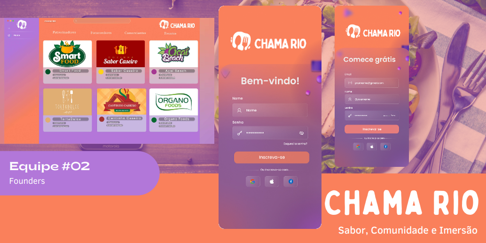

<h1 align="center">
    
    
</h1>
<h2 align="center">
    

</h2>

## 📕 Sobre
#### Community app para descobrir experiências e resturantes incríveis, conhecer roteiros e eventos que apoiam pequenos negócios e conectar a comunidade local.
##### [Apresentação em pdf](https://drive.google.com/file/d/1_R3ek9QDDlZtMIpyr5DoGNUeDKEM8gdZ/view?usp=sharing)

## 🔨 Tools
- [React](https://pt-br.legacy.reactjs.org/)
- [JavaScript](https://developer.mozilla.org/pt-BR/docs/Web/JavaScript/)
- [HTML](https://developer.mozilla.org/pt-BR/docs/Web/HTML) 
- [CSS](https://developer.mozilla.org/pt-BR/docs/Web/CSS)

## features
- Cadastramento Usuário.
- Inserção de Eventos.
- Criação de álbuns com fotos dos produtos.

## Equipe
- [Douglas Klem - Gerente de Banco de Dados](https://www.linkedin.com/in/klemdoug/)
- [Suzyelle Silva - Gerente de P&D](https://www.linkedin.com/in/suzyellesalvino/)
- [Jean Fraga Desenvolvedor](https://www.linkedin.com/in/devjeanfraga/)
- [Thiago Henrique - Gerente de Comunidade](https://www.linkedin.com/in/thiago-henrique-silva-3421aa171/)
## 📜 Licence 
[MIT](https://choosealicense.com/licenses/mit/)
